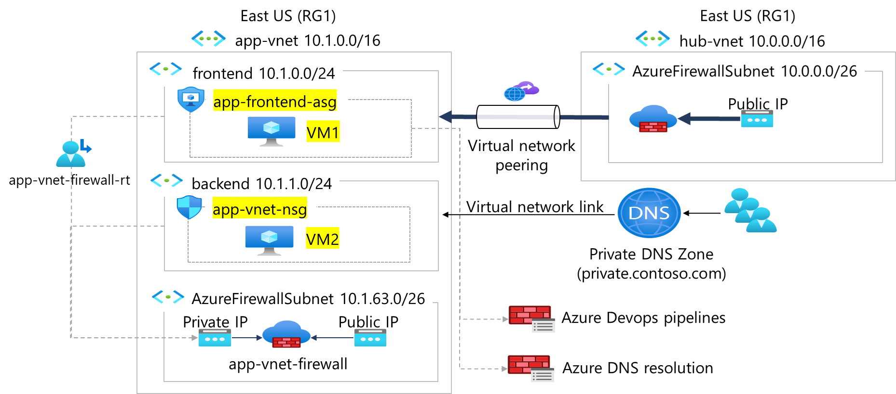

---
lab:
  title: 练习：控制进出 Web 应用程序的网络流量
  module: Guided Project - Configure secure access to workloads with Azure virtual networking services
---

# 实验室：控制进出 Web 应用程序的网络流量

## 场景

你的组织要求控制进出 Web 应用程序的网络流量。 若要进一步增强 Web 应用程序的安全性，可以配置网络安全组 (NSG) 和应用程序安全组 (ASG)。 NSG 是一个安全层，用于筛选进出 Azure 资源的网络流量，而 ASG 允许对资源分组进行共同管理。 这些安全组提供对进出 Web 应用程序组件的网络流量的精细控制。

### 体系结构关系图



### 技能任务

- 创建 NSG。
- 创建 NSG 规则。
- 将 NSG 关联到子网。
- 在 NSG 规则中创建和使用应用程序安全组。

## 练习说明

### 创建应用程序安全组

使用应用程序安全组 (ASG) 可将功能类似的服务器（例如 Web 服务器）分组到一起。

1. 在门户顶部的搜索框中，输入**应用程序安全组**。 在搜索结果中选择“应用程序安全组”。

1. 选择“+ 新建”。

    在“创建应用程序安全组”的“基本信息”**** 选项卡中，输入下表中列出的信息：

    | 属性       | 值                        |
    | :------------- | :--------------------------- |
    | 订阅   | 选择订阅 |
    | 资源组 | RG1****                      |
    | 名称           | **app-backend-asg**          |
    | 区域         | **美国东部**                  |

1. 选择“查看 + 创建”，然后选择“创建”。

[了解更多有关创建应用程序安全组的信息](https://docs.microsoft.com/azure/virtual-network/tutorial-filter-network-traffic#create-application-security-groups)。

>**备注**：您正在现有虚拟网络所在的同一区域中创建应用程序安全组。

### 创建并关联该网络安全组

网络安全组 (NSG) 保护虚拟网络中的网络流量。 NSG 包含一组安全规则，可以允许或拒绝流向连接到 Azure 虚拟网络 (VNet) 资源的网络流量。 NSG 可以与连接到 Azure 虚拟机 (VM) 的子网和/或单个网络接口关联。

1. 在门户顶部的搜索框中，输入**网络安全组**。 在搜索结果中选择“网络安全组”。

1. 选择“+ 新建”。

    在“创建网络安全组的”基本信息“**** 选项卡上，输入下表中列出的信息：

    | 属性       | 值                        |
    | :------------- | :--------------------------- |
    | 订阅   | 选择订阅 |
    | 资源组 | RG1****                      |
    | 名称           | **app-vnet-nsg**             |
    | 区域         | **美国东部**                  |

    [详细了解如何创建网络安全组](https://docs.microsoft.com/azure/virtual-network/tutorial-filter-network-traffic#create-a-network-security-group)。

1. 选择“查看 + 创建”，然后选择“创建”。

在本部分，你要将网络安全组与前面创建的虚拟网络的子网相关联。

1. 在门户顶部的搜索框中，输入“网络安全组”。 在搜索结果中选择网络安全组。

1. 在网络安全组列表中选择“app-vnet-nsg”****。

1. 在“app-vnet-nsg”**** 的“设置”部分选择“子网”****。

1. 在“子网”页中选择“+ 关联”****

1. 在“关联子网”**** 下，为“虚拟网络选择“app-vnet (RG1)“**** 为“子网”选择“后端”****，然后选择“确定”。

    [了解有关将网络安全组关联到子网的更多信息](https://docs.microsoft.com/azure/virtual-network/tutorial-filter-network-traffic#associate-a-network-security-group-to-a-subnet)。

### 创建网络安全组规则

网络安全组 (NSG) 保护虚拟网络中的网络流量。

1. 在门户顶部的搜索框中，输入**网络安全组**。 在搜索结果中选择网络安全组。

1. 在网络安全组列表中选择“app-vnet-nsg”****。

1. 在“app-vnet-nsg”**** 的“设置”部分选择“入站安全规则”****。

1. 选择“+ 添加”。

1. 在 “添加入站安全规则”**** 页上，输入下表中列出的信息：

    | 属性                               | 值                          |
    | :------------------------------------- | :----------------------------- |
    | 源                                 | **任意**                        |
    | 源端口范围                     | **\***                         |
    | 目标                            | **应用程序安全组** |
    | 目标应用程序安全组 | **app-backend-asg**            |
    | 服务                                | **SSH**                        |
    | 操作                                 | **允许**                      |
    | 优先级                               | **100**                        |
    | 名称                                   | **AllowSSH**                   |

    [详细了解如何创建网络安全组规则](https://docs.microsoft.com/azure/virtual-network/tutorial-filter-network-traffic#create-a-network-security-group)。

### 使用 Cloud Shell 部署 ARM 模板，创建本练习所需 VM

1. 在 Azure 门户中，选择 Azure 门户右上角的图标，打开 Azure Cloud Shell****。

1. 如果系统提示选择 Bash 或 PowerShell，请选择 PowerShell  。

    >**注意**：如果这是第一次启动 Cloud Shell，并看到“未装载任何存储”消息，请选择在本实验室中使用的订阅，然后选择“创建存储”  。

1. 使用 Cloud Shell 部署以下 ARM 模板，创建此练习所需 VM：

>**备注**：可以选择以下部分中的文本，并在 Cloud Shell 中对其复制/粘贴。

   ```powershell
   $RGName = "RG1"
   
   New-AzResourceGroupDeployment -ResourceGroupName $RGName -TemplateUri https://raw.githubusercontent.com/MicrosoftLearning/Configure-secure-access-to-workloads-with-Azure-virtual-networking-services/main/Instructions/Labs/azuredeploy.json
   ```
  
1. 若要验证 VM1**** 和 VM2**** 虚拟机是否正在运行，请导航到 RG1**** 资源组并选择 VM1****。

1. 验证虚拟机的状态是否为“正在运行”****。

1. 针对**** VM2 重复上一步。

### 将应用程序安全组关联到 VM 的网络接口

当你创建 VM 时，Azure 已经为每个 VM 创建了一个网络接口，并已将该接口附加到 VM。

将你之前创建的应用程序安全组与 VM2 网络接口关联。

1. 在 Azure 门户中，导航至 RG1**** 资源组并选择 VM2****。

1. 导航到 VM 的网络标签页，在“应用程序安全组****”部分选择“+ 添加应用程序安全组****”。

1. 在应用程序安全组列表中选择“app-backend-asg”****。

1. 选择 **添加** 。

  [了解有关在应用程序安全组中添加 NIC 的更多信息](https://learn.microsoft.com/en-us/azure/virtual-network/virtual-network-network-interface?tabs=azure-portal#add-or-remove-from-application-security-groups)。
